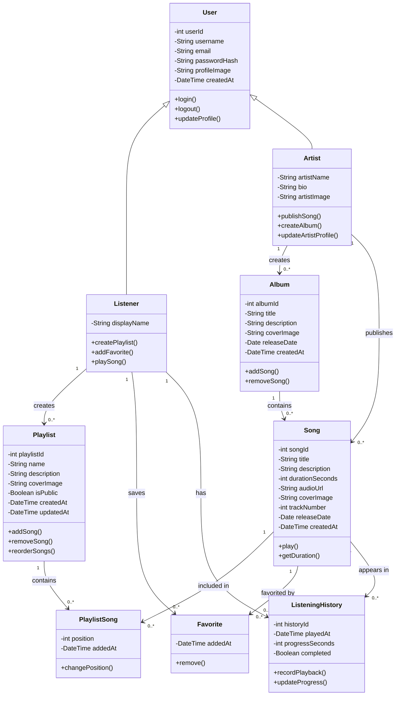

# UML Design Lab — PLD Activity

## Project Overview

**Project Type:** Holberton School — PLD Activity / UML Design Lab

### About the Project

This project is a UML design exercise for a music streaming platform.

The platform is similar to a basic music streaming service where users can listen to songs, create playlists, save favorite songs, and view their listening history. Artists can publish songs and create albums.

The project focuses on modeling the platform using EER and UML Class Diagrams.

### Project Idea

The idea is to design a simple music streaming platform centered around songs, artists, albums, playlists, and user listening activity.

---

## Team Organization

| Member | Responsibilities |
|---|---|
| Arwa | Task 0: Problem Analysis + Task 1: Class Diagram |
| Abdulrahman | Task 2: Sequence Diagram 1 + Sequence Diagram 2 |
| Khalid | Task 2: Sequence Diagram 3 + Task 3: Design Justification + Final Presentation |

---

## Task 0: Problem Analysis

### The Problem

A music streaming platform contains many songs, albums, artists, playlists, and user interactions. Without a well-structured system, it becomes difficult to manage the relationships between them.

### The Proposed System

A simple music streaming platform centered around songs. Artists publish songs and create albums, while users listen to songs, organize them into playlists, save favorites, and have their listening activity recorded.

### Main Users

- **Listeners:** users who listen to music.
- **Artists:** users who publish songs and create albums.

### Main Functionality

- User accounts
- Listener and Artist roles
- Song publishing
- Album creation
- Song playback
- Playlist management
- Favorite songs
- Listening history

### Why Structured Relationships Are Needed

One song can belong to an artist and an album, appear in many playlists, be saved as a favorite by many users, and appear in many listening history records. The system therefore needs clearly defined relationships between users, songs, artists, albums, playlists, and listening activity.

**Responsible:** Arwa
---

## Task 1: Database & Domain Modeling

**Responsible:** Arwa

### Part 1: EER Diagram

The EER diagram contains nine tables.

#### User
- **Represents:** The main account in the platform.
- **PK:** `user_id`
- **Attributes:** `username`, `email`, `password_hash`, `profile_image`, `created_at`
- **FK:** None
- **Purpose:** Main account information.

#### Listener
- **Represents:** A user who listens to music.
- **PK/FK:** `user_id` → User
- **Attributes:** `display_name`
- **Purpose:** Represents the listener specialization of User.

#### Artist
- **Represents:** A user who publishes music.
- **PK/FK:** `user_id` → User
- **Attributes:** `artist_name`, `bio`, `artist_image`
- **Purpose:** Represents the artist specialization of User.

#### Album
- **Represents:** A collection of songs released by an artist.
- **PK:** `album_id`
- **FK:** `artist_id` → Artist
- **Attributes:** `title`, `description`, `cover_image`, `release_date`, `created_at`
- **Purpose:** Represents an album created by an artist.

#### Song
- **Represents:** A single music track.
- **PK:** `song_id`
- **FKs:** `artist_id` → Artist, `album_id` → Album
- **Attributes:** `title`, `description`, `duration_seconds`, `audio_url`, `cover_image`, `track_number`, `release_date`, `created_at`
- **Purpose:** Represents a music track.
- **Note:** `album_id` may be NULL when the song is released as a single.

#### Playlist
- **Represents:** A list of songs created by a user.
- **PK:** `playlist_id`
- **FK:** `user_id` → User
- **Attributes:** `name`, `description`, `cover_image`, `is_public`, `created_at`, `updated_at`
- **Purpose:** Represents a playlist created by a user.

#### PlaylistSong
- **Represents:** The songs inside a playlist.
- **Composite PK/FKs:** `playlist_id` → Playlist, `song_id` → Song
- **Attributes:** `position`, `added_at`
- **Purpose:** Junction table connecting playlists and songs.

#### Favorite
- **Represents:** A song saved as a favorite.
- **Composite PK/FKs:** `user_id` → User, `song_id` → Song
- **Attributes:** `added_at`
- **Purpose:** Stores songs saved as favorites.

#### ListeningHistory
- **Represents:** An individual listening event.
- **PK:** `history_id`
- **FKs:** `user_id` → User, `song_id` → Song
- **Attributes:** `played_at`, `progress_seconds`, `completed`
- **Purpose:** Records listening activity.

### EER Relationships

| Relationship | Type |
|---|---|
| User → Listener | Specialization / Inheritance |
| User → Artist | Specialization / Inheritance |
| Artist → Album | 1:N |
| Artist → Song | 1:N |
| Album → Song | 1:N |
| User → Playlist | 1:N |
| Playlist ↔ Song | M:N through PlaylistSong |
| User ↔ Song | M:N through Favorite |
| User → ListeningHistory | 1:N |
| Song → ListeningHistory | 1:N |

---

### Part 2: UML Class Diagram

### Class Explanation

- **User** is the base account.
- **Listener** and **Artist** inherit from **User**.
- **Artist** creates albums and publishes songs.
- **Album** contains songs.
- **Listener** creates playlists.
- **PlaylistSong** connects playlists and songs.
- **Favorite** connects users with saved songs.
- **ListeningHistory** records listening activity.

### EER Diagram vs. Class Diagram

- **EER Diagram:** represents the database structure, tables, PKs, FKs, and database relationships.
- **Class Diagram:** represents classes, attributes, methods, inheritance, associations, and multiplicities.
  
**Responsible:** Arwa
---

## Task 2 — Sequence Diagrams

### Abdulrahman

Responsible for:

- Sequence Diagram 1
- Sequence Diagram 2

### Khalid

Responsible for:

- Sequence Diagram 3

---

## Task 3 — Design Justification

### Khalid

Responsible for:

- Design Justification

---

## Final Presentation

### Khalid

Responsible for:

- Final Presentation

---

## Requirements Compliance

- [x] Project Overview
- [x] Task 0 — Arwa
- [x] Task 1 — EER Diagram — Arwa
- [x] Task 1 — UML Class Diagram — Arwa
- [ ] Task 2 — Sequence Diagrams — Abdulrahman / Khalid
- [ ] Task 3 — Design Justification — Khalid
- [ ] Final Presentation — Khalid
