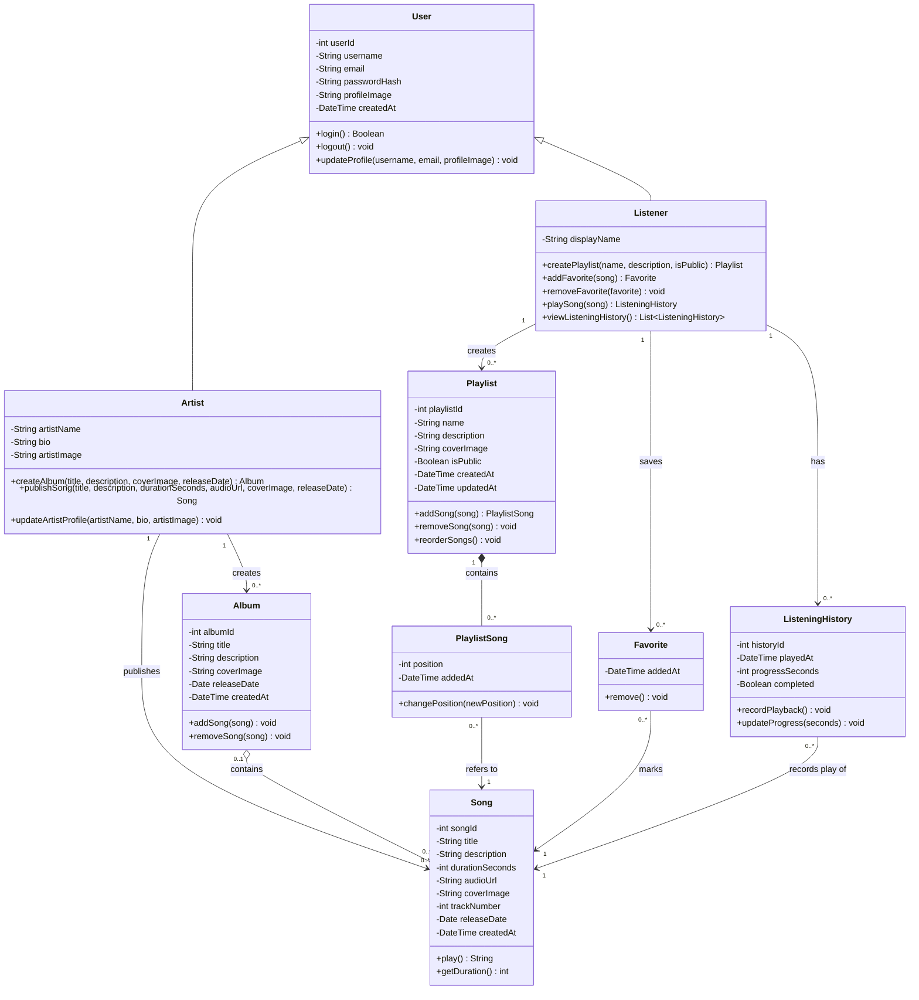
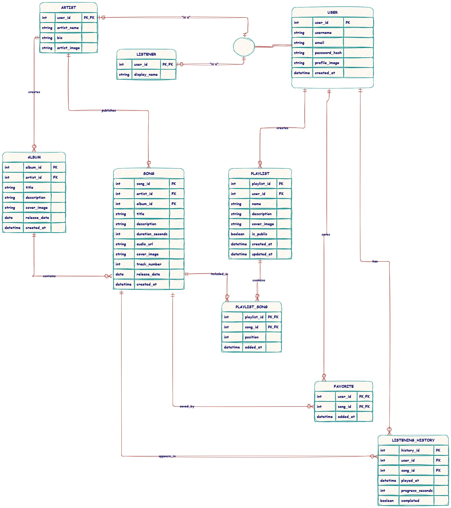
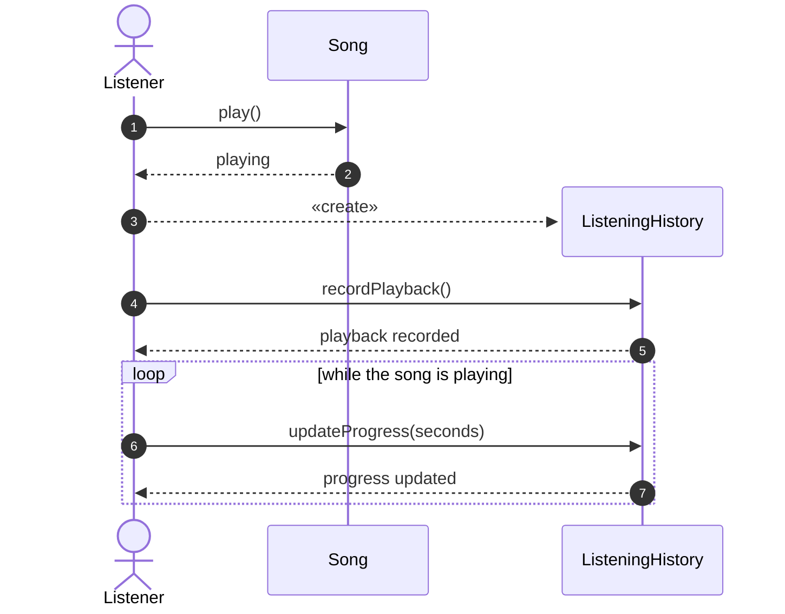
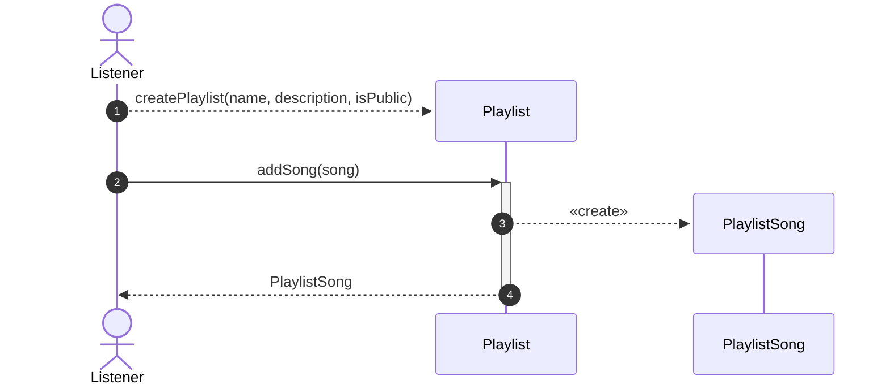
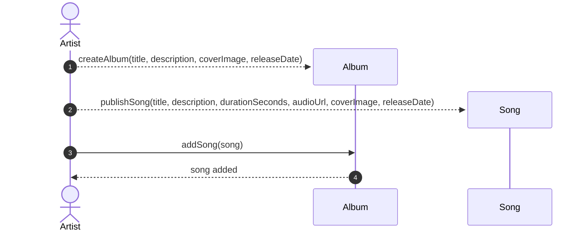
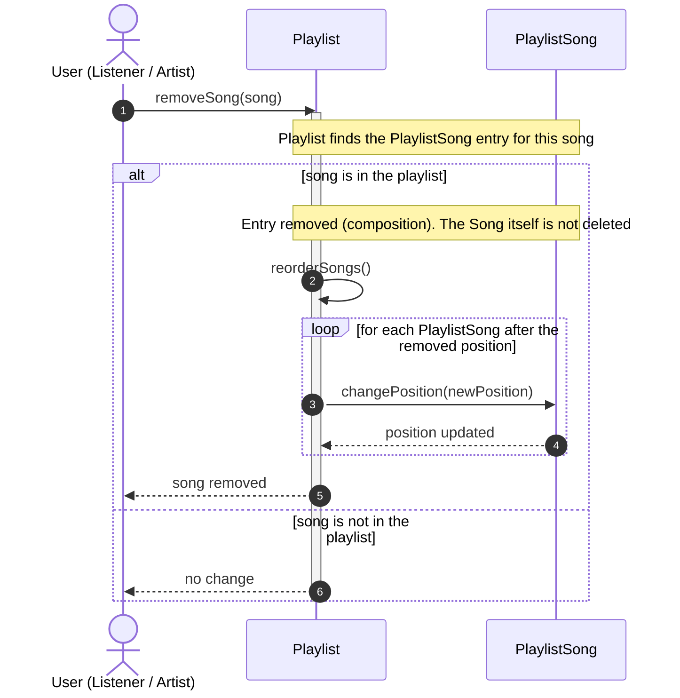

# Music Streaming Platform — UML Design

**Holberton School — PLD Activity / UML Design Lab**

| Member | Responsibilities |
|---|---|
| Arwa | Task 0: Problem Analysis + Task 1: Class Diagram |
| Abdulrahman | Task 2: Sequence Diagrams 1 and 2 |
| Khalid | Task 2: Sequence Diagram 3 + Task 3: Design Justification + Final Presentation |

---

## 1. Project Overview

A UML design of a basic music streaming platform. Listeners play songs, build playlists, save favorites and have their listening recorded. Artists publish songs and create albums. The design is modeled with an EER diagram (supplementary), a UML class diagram, and three sequence diagrams, all consistent with one domain model.

**Out of scope:** payments, subscriptions, social features, recommendations, podcasts, messaging.

---

## 2. Problem Analysis

### 2.1 Problem Context
A music platform holds many songs, albums, artists, playlists and user interactions. Without clearly defined relationships it is hard to know who owns what, which songs belong to which album, or which playlists contain a song.

### 2.2 System Goal
A simple platform centered on songs, where artists publish music and listeners listen to it, organize it and keep track of it.

### 2.3 Main Users
- **Listener:** listens to songs, creates playlists, saves favorites, has a listening history.
- **Artist:** creates albums and publishes songs.

### 2.4 Main Entities
User, Listener, Artist, Album, Song, Playlist, PlaylistSong, Favorite, ListeningHistory.

### 2.5 Main Use Cases
1. Listener plays a song (and optionally favorites it).
2. Listener creates a playlist and adds a song.
3. Artist creates an album and publishes a song into it.
4. Also supported by the model: remove a song from a playlist, remove a favorite, view listening history, update profile.

### 2.6 Key Relationships
- An Artist creates albums and publishes songs; an Album contains songs.
- A Listener creates playlists; a Playlist contains songs.
- A Listener saves favorite songs.
- A Listener's plays are recorded as listening history entries, each about one song.

### 2.7 Alternatives Considered
| Decision | Alternative A | Alternative B (chosen) | Why |
|---|---|---|---|
| User types | Listener and Artist as independent classes | `User` superclass with `Listener` and `Artist` subclasses | Both share account data (username, email, password, login). Independent classes would duplicate it. |
| Playlist ↔ Song | Direct many-to-many | `PlaylistSong` association class | The link carries its own data (`position`, `addedAt`), so it needs to be a class. |
| Favorite | Just a list of songs inside Listener | `Favorite` class | Stores `addedAt` and can be removed as an object. |
| History | A single `lastPlayed` field on Song | `ListeningHistory` class | A song has many plays by many listeners; each play has its own time and progress. |

---

## 3. Class Diagram

### Classes and responsibilities
- **User:** shared account data and account actions (login, logout, profile).
- **Listener:** everything a listening account can do: playlists, favorites, playback, history.
- **Artist:** artist profile, creating albums, publishing songs.
- **Album:** a collection of songs; manages its own membership.
- **Song:** one track; knows its own data and can be played.
- **Playlist:** a listener's ordered collection; manages its own songs and order.
- **PlaylistSong:** one song's place in one playlist (`position`, `addedAt`).
- **Favorite:** one listener's saved song, with the date saved.
- **ListeningHistory:** one play event: when, how far, whether completed.

### Multiplicity justification
- **Artist 1 → 0..* Album / Song:** every album and song has exactly one artist; a new artist may have none yet.
- **Album 0..1 → 0..* Song:** an album can be empty at creation; a song may be a single with no album. Aggregation (hollow diamond) because songs outlive album membership.
- **Listener 1 → 0..* Playlist:** a playlist belongs to exactly one listener; a listener may have none.
- **Playlist 1 → 0..* PlaylistSong (composition):** a PlaylistSong cannot exist without its playlist. **PlaylistSong 0..* → 1 Song:** one song can appear in many playlists (many-to-many through the association class); each entry refers to exactly one song.
- **Listener 1 → 0..* Favorite, Favorite 0..* → 1 Song:** many-to-many between Listener and Song; each Favorite has exactly one listener and one song.
- **Listener 1 → 0..* ListeningHistory, ListeningHistory 0..* → 1 Song:** each play belongs to one listener and one song; a new listener has no history.

### Relation to the EER diagram
 shows the database view of the same domain: tables, PKs, FKs. It is supplementary; the class diagram is the UML deliverable. Alignment notes:
#### User
- **Represents:** The main account in the platform.
- **PK:** `user_id`
- **Attributes:** `username`, `email`, `password_hash`, `profile_image`, `created_at`
- **FK:** None
- **Purpose:** Main account information.

#### Listener
- **Represents:** A user who listens to music.
- **PK/FK:** `user_id` → User
- **Attributes:** `display_name`
- **Purpose:** Represents the listener specialization of User.

#### Artist
- **Represents:** A user who publishes music.
- **PK/FK:** `user_id` → User
- **Attributes:** `artist_name`, `bio`, `artist_image`
- **Purpose:** Represents the artist specialization of User.

#### Album
- **Represents:** A collection of songs released by an artist.
- **PK:** `album_id`
- **FK:** `artist_id` → Artist
- **Attributes:** `title`, `description`, `cover_image`, `release_date`, `created_at`
- **Purpose:** Represents an album created by an artist.

#### Song
- **Represents:** A single music track.
- **PK:** `song_id`
- **FKs:** `artist_id` → Artist, `album_id` → Album
- **Attributes:** `title`, `description`, `duration_seconds`, `audio_url`, `cover_image`, `track_number`, `release_date`, `created_at`
- **Purpose:** Represents a music track.
- **Note:** `album_id` may be NULL when the song is released as a single.

#### Playlist
- **Represents:** A list of songs created by a user.
- **PK:** `playlist_id`
- **FK:** `user_id` → User
- **Attributes:** `name`, `description`, `cover_image`, `is_public`, `created_at`, `updated_at`
- **Purpose:** Represents a playlist created by a user.

#### PlaylistSong
- **Represents:** The songs inside a playlist.
- **Composite PK/FKs:** `playlist_id` → Playlist, `song_id` → Song
- **Attributes:** `position`, `added_at`
- **Purpose:** Junction table connecting playlists and songs.

#### Favorite
- **Represents:** A song saved as a favorite.
- **Composite PK/FKs:** `user_id` → User, `song_id` → Song
- **Attributes:** `added_at`
- **Purpose:** Stores songs saved as favorites.

#### ListeningHistory
- **Represents:** An individual listening event.
- **PK:** `history_id`
- **FKs:** `user_id` → User, `song_id` → Song
- **Attributes:** `played_at`, `progress_seconds`, `completed`
- **Purpose:** Records listening activity.

### EER Relationships

| Relationship | Type |
|---|---|
| User → Listener | Specialization / Inheritance |
| User → Artist | Specialization / Inheritance |
| Artist → Album | 1:N |
| Artist → Song | 1:N |
| Album → Song | 1:N |
| User → Playlist | 1:N |
| Playlist ↔ Song | M:N through PlaylistSong |
| User ↔ Song | M:N through Favorite |
| User → ListeningHistory | 1:N |
| Song → ListeningHistory | 1:N |
---
## Task 2 — Sequence Diagrams

### Sequence Diagram 1: Play a Song

**Explanation:**
1. The `Listener` asks the `Song` to play with `play()`, and the `Song` confirms.
2. Only now is a `ListeningHistory` created (dashed arrow). It does not exist before the song is played, because it records this specific play event.
3. The `Listener` asks the new `ListeningHistory` to record the play with `recordPlayback()`. `ListeningHistory` is only responsible for recording the event, not for playing the song.
4. The `ListeningHistory` confirms with `playback recorded`.
5. While the song is playing, the progress is updated with `updateProgress(seconds)`.

*By Abdulrahman*

### Sequence Diagram 2: Create a Playlist and Add a Song

**Explanation:**
1. The `Listener` requests a new playlist with `createPlaylist(name, description, isPublic)`. A new `Playlist` object is created with its own lifeline (dashed arrow).
2. The `Listener` asks the `Playlist` to add a song with `addSong(song)`. The `Playlist` manages its own songs and their order.
3. The `Playlist` creates a `PlaylistSong`. It is a real class in the Class Diagram, and it represents the link between the `Playlist` and the `Song`, with its `position` and `addedAt`.
4. The `Playlist` returns the new `PlaylistSong` to the `Listener`.

*By Abdulrahman*

### Sequence Diagram 3: Create an Album and Publish a Song

**Explanation:**
1. The `Artist` creates a new `Album` with `createAlbum(...)`.
2. The `Artist` publishes a new `Song` with `publishSong(...)`. The song exists on its own before it joins an album.
3. The `Artist` asks the `Album` to include the song with `addSong(song)`. The `Album` manages its own songs.
4. The `Album` confirms with `song added`.

*By Abdulrahman*

### Sequence Diagram 3: Remove a Song from a Playlist

**Explanation:**
1. The `Listener` asks the `Playlist` to remove a song with `removeSong(song)`. The `Playlist` manages its own songs, so it is responsible for removing them.
2. The `Playlist` finds the `PlaylistSong` entry that links this song to the playlist.
3. If the song is in the playlist, the `PlaylistSong` entry is removed. Because of the composition, a `PlaylistSong` cannot exist without its `Playlist`. The `Song` itself is not deleted, because it can still belong to its album and to other playlists.
4. The `Playlist` reorganizes its order with `reorderSongs()`.
5. For each song that was after the removed one, the `Playlist` updates its position with `changePosition(newPosition)`, so there are no gaps in the order.
6. The `Playlist` confirms with `song removed`. If the song was not in the playlist, it replies with `no change`.

*By Khalid*

---

## Task 3 — Design Justification

### Khalid

## Task 3 — Design Justification

### 1. Main Design Decisions
- **`User` superclass with `Listener` and `Artist` subclasses:** both share the same account data (username, email, password) and actions (login, logout, update profile), so inheritance avoids duplication.
- **`PlaylistSong` association class:** the link between a playlist and a song has its own data (`position`, `addedAt`), so it cannot be a simple many-to-many line.
- **Composition between `Playlist` and `PlaylistSong`:** an entry has no meaning outside its playlist. Deleting a playlist deletes its entries, but never the songs.
- **Following the scenario literally:** no playback is modeled ("Avoid modeling streaming or playback behavior"), and every song belongs to an album ("A song belongs to an album").

### 2. Responsibilities
| Class | Responsibility |
|---|---|
| `User` | Account data and actions; creates and owns playlists |
| `Listener` / `Artist` | Add their own data; `Artist` creates albums and publishes songs |
| `Playlist` | Manages its own songs and their order (`addSong`, `removeSong`, `reorderSongs`) |
| `PlaylistSong` | Knows one song's place in one playlist (`changePosition`) |
| `Album` | Manages its own songs |
| `Song` | Knows its own data |

Each class manages its own data. For example, the `User` never edits a `PlaylistSong` directly; it asks the `Playlist`, which is responsible for its content.

### 3. Relationships and Multiplicities
| Relationship | Multiplicity | Reason |
|---|---|---|
| `User` → `Playlist` | 1 → 0..* | A playlist has one owner; a new user has none |
| `Playlist` ◆ `PlaylistSong` | 1 → 0..* | An empty playlist is valid |
| `PlaylistSong` → `Song` | 0..* → 1 | One song can be in many playlists |
| `Artist` → `Album` | 1 → 0..* | Every album has exactly one artist |
| `Album` → `Song` | 1 → 0..* | Every song belongs to one album |
| `Artist` → `Song` | 1 → 0..* | Every song has exactly one artist |

### 4. Alternatives Considered
| Alternative | Why we rejected it |
|---|---|
| `Listener` and `Artist` as separate classes | Duplicates account data and login |
| Direct many-to-many `Playlist` ↔ `Song` | Nowhere to store `position` and `addedAt` |
| `Album` 0..1 (songs without an album) | Breaks "A song belongs to an album" |
| `ListeningHistory` and `play()` | The scenario says to avoid playback behavior |
| `createPlaylist()` only in `Listener` | Artists are users too; the EER links playlists to `User` |

### 5. Trade-offs
- **Inheritance:** one more class, but no duplicated fields or methods.
- **`PlaylistSong`:** an extra class, but the order of songs is stored correctly.
- **Song must have an album:** matches the scenario, but a single needs an album with one track.
- **Small model:** easy to understand and extend (for example, following an artist only needs a new association), but features outside the scenario are not covered.

*By Khaled*

## Requirements Compliance

- [x] Project Overview
- [x] Task 0 — Arwa
- [x] Task 1 — EER Diagram — Arwa
- [x] Task 1 — UML Class Diagram — Arwa
- [ ] Task 2 — Sequence Diagrams — Abdulrahman / Khalid
- [x] Task 3 — Design Justification — Khalid
- [x] Final Presentation — Khalid
